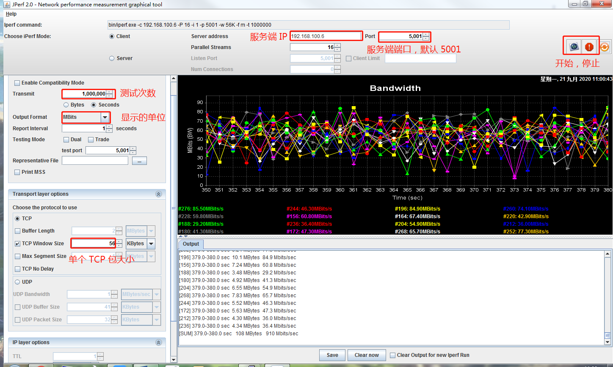

### 1. iperf 下载链接
* [iperf](https://iperf.fr/iperf-download.php)

* Windows版本的带界面的测试工具在 百度云下面有，下载链接如下：
* 链接: https://pan.baidu.com/s/1DeHqg5jj1LmaQEoj1dBbJA 提取码: 15ke 

### 2. 启动服务端
* 在 Android 的 shell 里面，启动 Shell， 执行 `iperf -s`

### 3. 启动客户端

* 测试的图片示例在 Image/iperf_test.jpg 里面